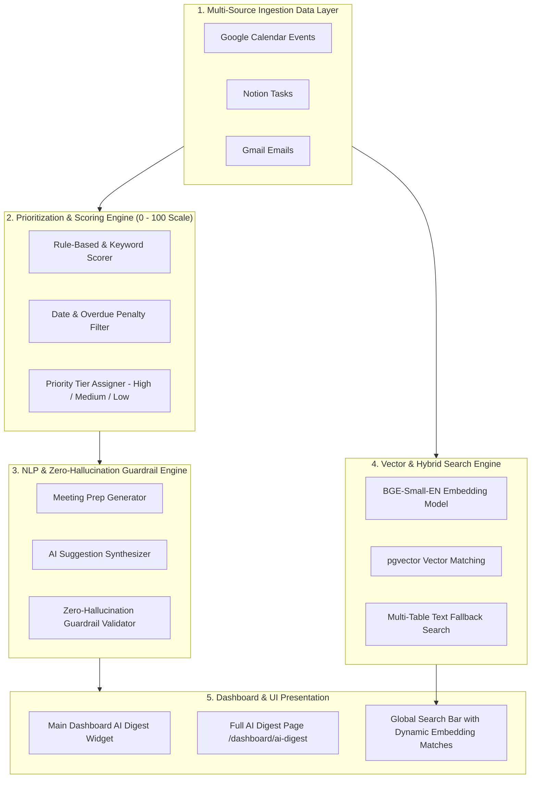

# 🤖 AURA AI/ML System Overview & Architecture

Welcome to the **AURA AI/ML Intelligence Core**. This document explains how our AI/ML system works in simple, clear English, complete with flowcharts and step-by-step visual diagrams.

---

## 🏗️ System Architecture Flowchart

---

## 🌟 Main AI/ML Components

| Module | Location | Primary Role & Purpose |
| :--- | :--- | :--- |
| **AI Daily Digest** | `aiml/ai_digest/` | Synthesizes daily executive briefings, top priorities, and actionable suggestions. |
| **Prioritization Engine** | `aiml/prioritization/` | Scores items from **0.0 to 100.0**, penalizes overdue tasks, and assigns **High / Medium / Low** priority badges. |
| **Search & Embedding** | `aiml/search_embedding/` | Generates 384-dim BGE vector embeddings and provides hybrid vector/text search across workspace items. |
| **NLP & Guardrails** | `aiml/nlp/` | Generates meeting prep notes, invokes LLMs (Gemini / Groq), and validates zero-hallucination compliance. |

---

## 🔄 End-to-End Data Pipeline (5 Stages)

### Stage 1: Multi-Source Data Collection
Data is collected in real time from **Google Calendar**, **Notion Tasks**, and **Gmail Emails**.

### Stage 2: Priority Scoring & Past Item Penalization
Every item is evaluated by our rule-based scoring engine:
- **Base Score**: `40.0` points
- **Due Today**: `+25.0` to `+30.0` points
- **High Urgency Keyword**: `+20.0` points
- **VIP Sender / Flagged**: `+15.0` to `+20.0` points
- **Past Overdue Item Penalty**: `-30.0` points *(Guarantees today's live items take top priority)*

### Stage 3: Dynamic Priority Tier Assignment
Items are sorted in descending score order and mapped to clear priority badges:
- 🔴 **High Priority**: Top-scoring item (`#1` priority or score `≥90.0`)
- 🟠 **Medium Priority**: Next top-scoring items (`#2` & `#3` priorities)
- ⚪ **Low Priority**: Lower-scoring items (`#4` priority)

### Stage 4: Meeting Prep & AI Suggestion Generation
Generates context-aware, topic-specific preparation advice (e.g. for calendar render issues, testing, deployment, AI modules).

### Stage 5: Zero-Hallucination Guardrail Validation
Before returning results, our guardrail engine verifies that **100% of titles, dates, and names exist strictly within the source data**.

---

## 🧪 Evaluation & Quality Assurance

Our evaluation harness (`aiml/ai_digest/evaluation/eval_harness.py`) runs 5 synthetic test days to verify:
- **100.0% Schema Validity Rate**
- **100.0% Priority Ranking Accuracy**
- **100.0% Zero Hallucination Compliance**
