# 📊 AI Daily Digest Engine (`aiml/ai_digest/`)

The **AI Daily Digest Engine** orchestrates daily briefings, top priority selection, context-aware meeting prep notes, and zero-hallucination guardrail verification for the AURA platform.

---

## 💡 How AI Digest Works (Step-by-Step Flowchart)

```mermaid
flowchart LR
    A[Fetch Today's Tasks, Events & Emails] --> B[Filter Items for Current Date]
    B --> C[Compute Priority Scores 0-100]
    C --> D[Sort Items in Descending Order]
    D --> E[Select Top 4 Priorities]
    E --> F[Generate Topic-Specific Meeting Prep Notes]
    F --> G[Synthesize Natural AI Suggestions]
    G --> H[Run Zero-Hallucination Guardrail]
    H --> I[Deliver Real-Time JSON Payload to Dashboard]
```

---

## 🎯 Key Capabilities

1. **Real-Time Data Processing**:
   - Queries current day's events from Google Calendar, tasks from Notion, and emails from Gmail.
   - Calculates today's specific pending task, scheduled meeting, and email message metrics.

2. **Top Priorities Selection**:
   - Ranks all items using the prioritization scoring engine.
   - Selects the top 4 items and assigns dynamic **High**, **Medium**, and **Low** priority badges.

3. **Context-Aware Meeting Prep Notes**:
   - Evaluates meeting titles and produces topic-specific preparation advice:
     - **Calendar / Render**: *"Review calendar view rendering logic, event time zone parsing, and state synchronization across dashboard widgets."*
     - **AI / NLP**: *"Review AI/NLP module metrics, zero-hallucination guardrail evaluation accuracy, and real-time pipeline endpoints."*
     - **Testing**: *"Prepare comprehensive test cases, API endpoint validation scripts, and integration test coverage reports."*
     - **UI / Redesign**: *"Review design mockups, component states, and responsive layout guidelines."*

4. **Zero-Hallucination Guardrail (`guardrail.py`)**:
   - Ensures no fake titles, dates, or non-existent metrics are ever presented to the user.

---

## 📁 File Structure

| File | Purpose |
| :--- | :--- |
| `digest_generator.py` | Main entry point for generating the daily digest payload. |
| `guardrail.py` | Validates that all items in the digest match real source records. |
| `evaluation/eval_harness.py` | Automated evaluation harness testing schema validity and ranking accuracy. |
