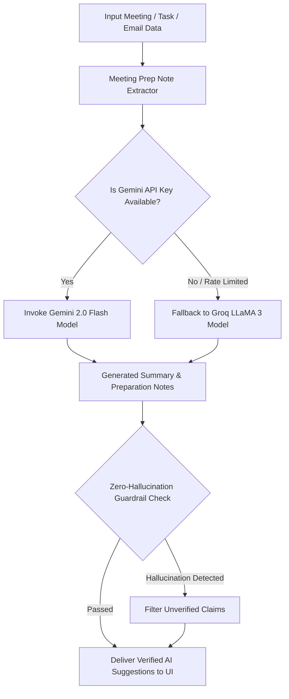

# 💬 NLP & LLM Intelligence Core (`aiml/nlp/`)

The **NLP Core** handles natural language processing, LLM summarization (Gemini 2.0 API with Groq fallback), meeting prep generation, and zero-hallucination guardrail validation.

---

## 🧠 NLP Processing & LLM Fallback Flowchart

---

## 🛡️ Zero-Hallucination Guardrails (`guardrails.py`)

Our zero-hallucination guardrail ensures strict reliability:
1. **Source Grounding**: Checks that every title, name, date, and metric in the generated summary exists verbatim in the source data.
2. **Fact Validation**: Strips out hallucinated claims or fabricated meeting times.
3. **Audit Flag**: Attaches `guardrail_passed: true` metadata to verified AI Digest payloads.

---

## 📁 File Structure

| File | Function |
| :--- | :--- |
| `summarizer.py` | LLM summarizer with Gemini 2.0 primary and Groq fallback. |
| `meeting_prep.py` | Topic-based and context-aware meeting preparation advice generator. |
| `extractors.py` | Extracts entities, deadlines, and intent from raw text. |
| `guardrails.py` | Zero-hallucination verification engine. |