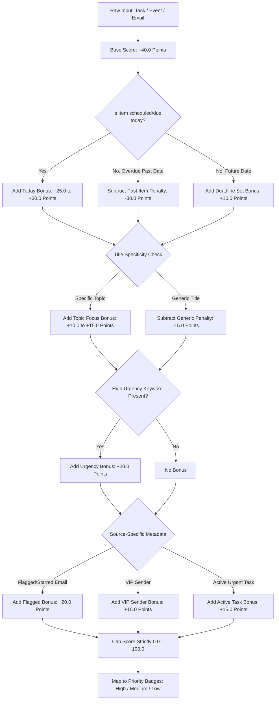

# ⚡ Multi-Source Prioritization Engine (`aiml/prioritization/`)

The **Prioritization Engine** scores, ranks, and categorizes workspace items (Tasks, Events, and Emails) on a strict **0.0 to 100.0** scale.

---

## 📈 Scoring & Ranking Flowchart

---

## 🎯 Scoring Breakdown Rules

| Rule | Score Adjustment | Reason Tag |
| :--- | :---: | :--- |
| **Base Starting Score** | `+40.0` | Initial baseline |
| **Scheduled / Due Today** | `+25.0` to `+30.0` | `Due today` / `Today's meeting` / `Today's email` |
| **Overdue / Past Item Penalty** | `-30.0` | `Past item penalty` *(Deprioritizes historical clutter)* |
| **High Urgency Keyword** (`urgent`, `high`, `asap`, `critical`, `p0`, `blocker`) | `+20.0` | `High urgency keyword` |
| **Flagged / Starred Email** | `+20.0` | `Flagged email` |
| **VIP Sender** (`boss`, `lead`, `client`, `manager`) | `+15.0` | `VIP sender email` |
| **Specific Topic Focus** | `+10.0` to `+15.0` | `Specific topic focus` |
| **Generic Title** (`sync`, `meeting`, `untitled`) | `-15.0` | `Generic title` |

---

## 🏷️ Dynamic Priority Tier Mapping

After scoring, items are sorted in descending order:
- 🔴 **High Priority**: Ranked `#1` or Score `≥ 90.0`
- 🟠 **Medium Priority**: Ranked `#2` or `#3` (Score `70.0 – 89.0`)
- ⚪ **Low Priority**: Ranked `#4` (Score `< 70.0`)
