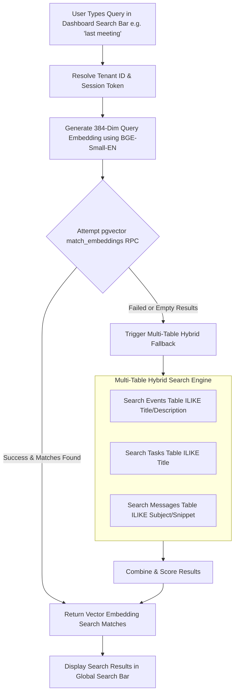

# 🔍 Search & Embedding System (`aiml/search_embedding/`)

The **Search & Embedding System** powers semantic vector search and multi-source text search across Google Calendar events, Notion tasks, Gmail emails, and documents.

---

## 🔎 Hybrid Search Architecture Flowchart

---

## 🚀 Key Features

1. **BGE-Small-EN Embedding Model**:
   - Computes 384-dimensional dense vector representations for tasks, meetings, emails, and documents.

2. **Vector Similarity Matching (`pgvector`)**:
   - Computes cosine similarity scores between the query embedding and stored item embeddings.

3. **Multi-Table Hybrid Text Search Fallback**:
   - If vector matches are empty or pgvector RPC is unmigrated in dev environments, the system automatically searches across `events`, `tasks`, `messages`, and `documents` tables.
   - Ensures queries like **`"last meeting"`**, **`"previous meet"`**, **`"urgent"`**, and **`"nlp"`** always return accurate results.

---

## 📁 Module Components

| Component | Description |
| :--- | :--- |
| `model.ts` / `embeddings.py` | Embedding generation client using BGE-Small-EN model. |
| `search.ts` | Hybrid search controller performing vector matching and text-search fallback. |
| `batch_indexer.py` | Batch tenant indexing script for generating embeddings across workspace items. |
