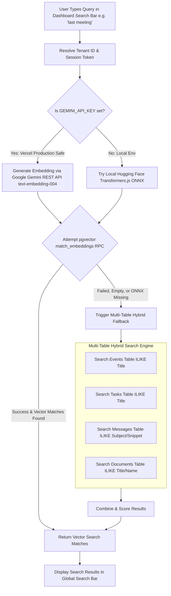

# 🔍 Search & Embedding System (`aiml/search_embedding/`)

The **Search & Embedding System** powers semantic vector search and multi-source text search across Google Calendar events, Notion tasks, Gmail emails, and documents.

---

## 🔎 Hybrid Search Architecture Flowchart

---

## 🚀 Key Features

1. **Google Gemini REST API Embedding (`text-embedding-004`)**:
   - Generates 384-dimensional dense vector embeddings via pure HTTPS `fetch()` requests using your `GEMINI_API_KEY`.
   - **Zero Native C++ ONNX Binaries (`libonnxruntime.so.1`) Required**: Runs 100% reliably in Vercel serverless functions without crashing any background route.

2. **Vector Similarity Matching (`pgvector`)**:
   - Computes cosine similarity scores between the query embedding and stored item embeddings in Supabase.

3. **Multi-Table Hybrid Search Fallback**:
   - If vector matches are empty or pgvector RPC is unmigrated in dev environments, the system automatically executes parallel queries across `events`, `tasks`, `messages`, and `documents` tables.
   - Natural language queries like **`"last meeting"`**, **`"previous meet"`**, **`"recent task"`**, **`"urgent"`**, and **`"nlp"`** instantly return matching items across the workspace.

---

## 📁 Module Components

| Component | Location | Description |
| :--- | :--- | :--- |
| `model.ts` | `src/lib/embeddings/model.ts` | REST API & ONNX embedding generator with zero-crash fallback. |
| `search.ts` | `src/lib/embeddings/search.ts` | Hybrid search controller performing vector matching and multi-table text fallback. |
| `route.ts` | `src/app/api/search/semantic/route.ts` | Authenticated Next.js API endpoint for global search. |
| `batch_indexer.py` | `aiml/search_embedding/batch_indexer.py` | Batch tenant indexing script for generating embeddings across workspace items. |
